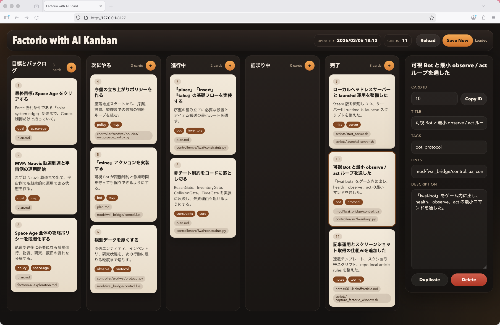
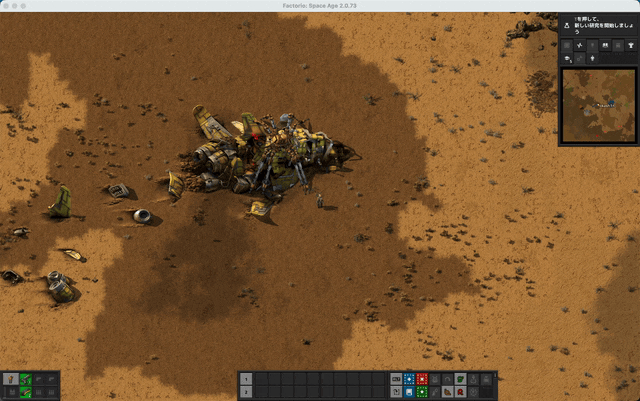

# Factorio Space AgeをCodexにクリアさせたい Day02

どうも、おかしんです。  
Day02 は本来、ローカルでFactorioのタスクを管理して、自分も観測しやすいようにする Kanban を作って運用面を整えたのと、FWAI Botを実際にCodexから動かしてみるところまでやりました。

## 固定リンク

- リポジトリ  
  https://github.com/okash1n/factorio-with-ai
- 記事まとめ  
  https://note.com/okash1n/m/m9def00095cdf

## 今回の進捗

- ローカル保存型の Kanban を追加して、Codex と人間が同じ作業面を見ながら進められるようにした
- Steam版 Factorio の app bundle 内に、2.0.73 の公式 API docs が入っていると分かった
- 進行中の 7 と 8 を進めて、『move』『take』『insert』の最小経路をゲーム内で通した
- 観測者がサーバーへ入っていないときは action を流さないガードを追加した
- GitHub Projects と Issue は後で公開する前提にしつつ、いまはローカル側を主データとして回す方針にした

## まずローカル board を作った

今回入れたのは、リポジトリ内で完結する軽い Kanban です。  
ブラウザで開けて、列ごとにカードを見られて、右側の inspector で中身を編集できます。  
カードには数字の ID も付けてあるので、AI と会話するときに「あのタスク」ではなく「7 を進めよう」「8 を見よう」とそのまま話せます。

将来的には読者にも見える形でGitHub Projectなどにも同期しようかとは思ってますが、一旦いまのフェーズでは、運用速度を重視しました。
ローカルで持っておくと、Codexもアクセスしやすいですしね。

task の実体をmarkdownにしておいたので board は単なる見た目ではなく、コード、plan、記事と同じ場所にある作業面になりました。  
人間だけのメモではなく、AI と一緒に project を進めるための操作面になったわけです。

## 大きな発見（APIドキュメントがローカルにある）

今回の作業で、かなり大きい発見がありました。  
Steam版の Factorio の app bundle の中に、公式の API docs 一式がそのまま入っていたことです。

これは想像以上に効きます。  
今回みたいに Mod 側で『LuaEntity』『LuaSurface』『defines.inventory』あたりを触ると、API 名や inventory 定数を一個取り違えるだけでその場で壊れます。  
しかも Space Age 前提なので、2.0 系の仕様をそのまま見られないと意味がありません。

でもローカルに公式 docs が入っているなら、

- Web 検索より速い
- その場で動いている 2.0.73 と仕様がズレない
- 一次情報を見ながらそのまま実装できる

という状態になります。

これは人間にとって便利というだけではなく、Codex から見てもかなり大きいです。  
今回も『spider_trunk』や entity の inventory 解決まわりは、このローカル docs を見ながら詰めました。

AI にゲームをやらせる project では、観測と実行だけでなく、「仕様をどれだけ正確に引けるか」もかなり重要です。  
そういう意味で、このローカル docs の存在は Day02 の中でもかなり大きい発見でした。

## board を作ったら、本当に重要なカードが見えた

board を入れてみると、夢のある backlog より、いま詰めるべきカードがどれかがはっきりしました。  
特に重要だったのは、進行中に置いてあった次の 2 枚です。

- 『非チート制約をコードに落とし切る』
- 『place』『insert』『take』の基礎フローを実装する

『Space Age 全体の攻略ポリシーを段階化する』ももちろん重要です。  
ただ、今のボトルネックはそこではありませんでした。

制約が曖昧なまま進めると、あとから全部が「それはチートでは」という話になります。  
逆に、設置と搬送が出来ないと、採掘だけ通っても工場は立ち上がりません。  
つまり、攻略方針より先に、Bot がゲーム内のルールでちゃんと手足を動かせることを証明する必要がありました。

ここで整理した前提はかなり重要です。  
今回の project では、プレイヤー inventory は使いません。  
使ってよいのは、Bot 自身の inventory と、ゲーム内に実在する container や machine の inventory だけです。

加えて、次の制約を前提にしました。

- Bot が届かない場所へ遠隔で置かない
- Bot が届かない場所へ遠隔で出し入れしない
- まず移動して、その位置で作業する
- 観測者がサーバーへ入っていないときは action を流さない

この最後はかなり大きいです。  
サーバーだけが動いている時間に AI が勝手に進めると、あとで事故が起きたときに観測も介入もできません。  
なので「観測者が入っているときだけ action を許可する」というガードを入れました。

『CollisionGate』や『TimeGate』はまだ粗いですし、『place』の実演もこれからです。  
ただし、最小版としてはかなり重要なところまで来ました。

## ついに『FWAI Bot』が動いた

今回の Day02 を締めるうえで、一番大きかったのはここです。  
2026-03-06 時点で、実際に『FWAI Bot』がゲーム内で移動し、container から item を取り出し、別の container へ入れるところまで確認できました。

この GIF も、単に画面録画アプリで雑に撮ったわけではありません。  
AppleScript で Factorio の window 座標を取り、その範囲を『screencapture』で録画し、最後に『ffmpeg』と『gifski』で GIF に変換しています。  
つまり記事用の素材取得も、リポジトリ内の手順として再現できる形に寄せています。

今回通したのは、ざっくり言うと次の流れです。

- Bot を reset する
- target の container まで move する
- container から iron-plate を 1 枚 take する
- 別の container まで move する
- そこへ iron-plate を 1 枚 insert する

ここで重要なのは、単に画面上でそれっぽく動いた、ではないことです。  
観測、制約チェック、action 実行を通したうえで、その結果がゲーム内の entity inventory に反映されているところまで見ています。

今回は policy を無理に広げず、まず『one-shot runner』を足して 1 action ずつ安全に流せるようにしました。  
これはかなり良かったです。  
まだ序盤の判断ロジックが固まり切っていない段階で policy を太らせるより、まず行動単位で実装を検証できるからです。

つまり Day02 の時点で確認できたのは、

- Mod 側に action 実装がある
- controller 側に最小制約がある
- RCON 経由で action を流せる
- その結果がゲーム内で観測できる

という一連のループです。

これはかなり大きいです。  
まだ「クリアに向かって賢く遊べる」段階ではありませんが、少なくとも「ゲーム内の実体が、ルールを守って、ちゃんと触れる」段階までは来ました。

## おわりに

今回はDay02として、ちゃんと動かせるところまできたのと、運用基盤や計画の基盤も整ったので良かったです。

GitHub Projects と Issue については、Space Age 攻略チャートの分解がもう少し固まったところで公開します。  
いまはまだ内部側の試行錯誤が多いので、ローカル board を主データにしておく方が筋が良いです。

## 次にやること

次はここからです。

- 『place』を live で見せる
- 『CollisionGate』と『TimeGate』をもう一段詰める
- 序盤の攻略ポリシーを分解する
- そのうえで GitHub Projects と Issue に公開できる形へ整理する

Day02 は思ったよりだいぶ濃い回になりました。  
次は、ここで作った足場の上に、実際の序盤攻略を積み上げていきます。
